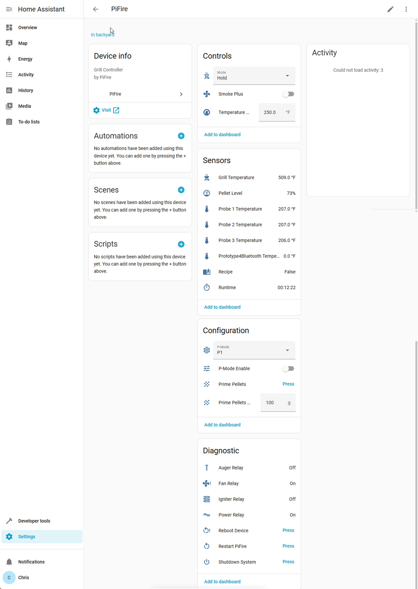

# PiFire Home Assistant Integration

[](https://hacs.xyz/)
[](https://github.com/voidlock/ha-pifire/releases)
[](LICENSE)

Home Assistant custom integration for [PiFire](https://github.com/nebhead/PiFire).  
This integration allows you to monitor and control your PiFire-powered pellet grill directly from Home Assistant.


📚 Official PiFire documentation is available here:  
👉 [PiFire Docs](https://nebhead.github.io/PiFire-Pages/)

---
## Screenshots

Here’s how the PiFire integration looks in Home Assistant:



---

## ✨ Features

- ✅ Live grill temperature sensor  
- ✅ Probe 1 & Probe 2 temperature sensors  
- ✅ Pellet level and pellet type sensors  
- ✅ Current grill mode, status, and units  
- ✅ Control grill setpoints & notify temps  
- ✅ One-click buttons for **Startup**, **Shutdown**, and **Prime**  
- ✅ Mode selector (Stop / Smoke / Hold / Monitor, etc.)  
- ✅ [Planned] Auto-discovery via Zeroconf & MQTT  

---

## 📂 File Structure

The integration lives under:
```
config/
└── custom_components/
└── pifire/
├── init.py
├── manifest.json
├── const.py
├── config_flow.py
├── sensor.py
├── number.py
├── select.py
├── switch.py
├── button.py
├── diagnostics.py
├── strings.json
└── translations/
└── en.json
```

---
# Installation

You can install the PiFire integration for Home Assistant either **via HACS** (recommended) or manually.

---

## Option 1: Install via HACS (Recommended)

1. Make sure you have [HACS](https://hacs.xyz/) installed in your Home Assistant.
2. In Home Assistant, go to **HACS → Integrations**.
3. Open the menu (⋮) in the top right → **Custom repositories**.
4. Add this repository URL:```https://github.com/VoidLock/ha-pifire```
Category: **Integration**

5. Back in HACS, search for **PiFire** under Integrations.
6. Click **Download** to install it.
7. **Restart Home Assistant**.
8. Go to **Settings → Devices & Services → Add Integration**.
9. Search for **PiFire**, then enter the host or IP of your PiFire controller (e.g. `pifire.local` or `192.168.x.x`).

---

## Option 2: Manual Installation

1. Download the latest release of this repository as a ZIP file from the [Releases page](../../releases).
2. Extract the archive.
3. Copy the folder:```custom_components/pifire``` into your Home Assistant `config/custom_components/` directory.  
Your setup should look like:
```
config/
└── custom_components/
    └── pifire/
    ├── init.py
    ├── manifest.json
    ├── const.py
    ├── config_flow.py
    ├── sensor.py
    ├── number.py
    ├── button.py
    ├── select.py
    ├── pifire_client.py
    ├── strings.json
    └── translations/
        └── en.json
```
4. **Restart Home Assistant**.
5. Go to **Settings → Devices & Services → Add Integration**.
6. Search for **PiFire**, then enter the host or IP of your PiFire controller.

---

## Updating

- **HACS installs:** Update directly through the HACS UI when a new version is released.
- **Manual installs:** Replace the `pifire` folder inside `custom_components` with the new version from the [Releases page](../../releases), then restart Home Assistant.
---


## Font Attribution

This project’s logo uses the [Orbitron](https://www.theleagueofmoveabletype.com/orbitron) font by Matt McInerney, licensed under the [SIL Open Font License](https://scripts.sil.org/OFL).

## License
This project is licensed under the MIT License - see the [LICENSE](LICENSE) file for details.

